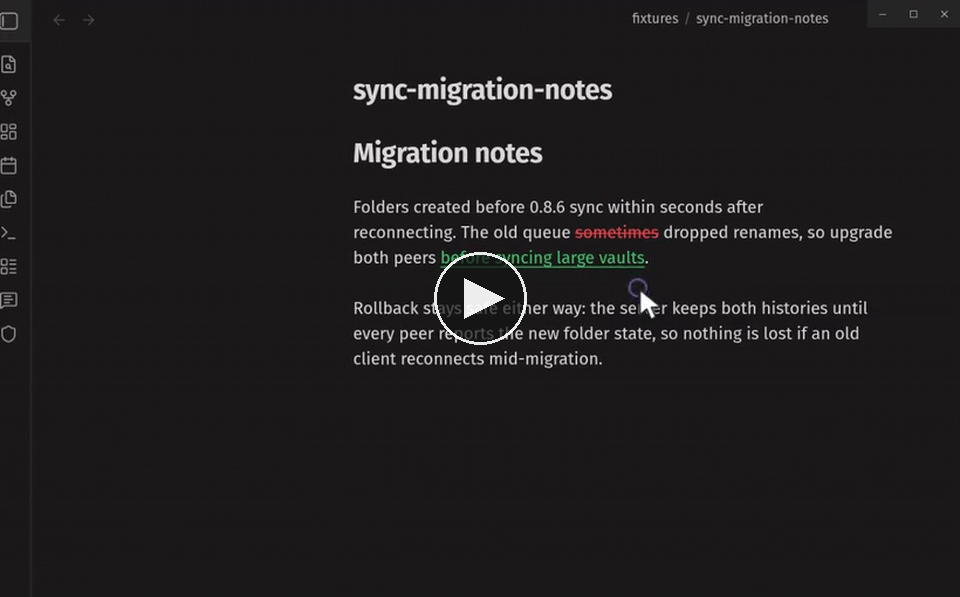
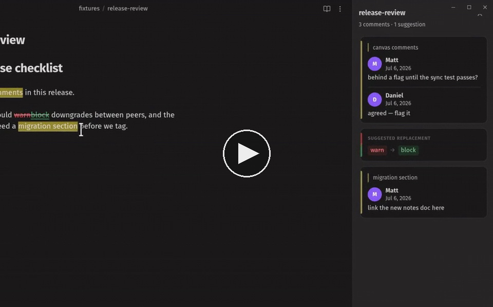
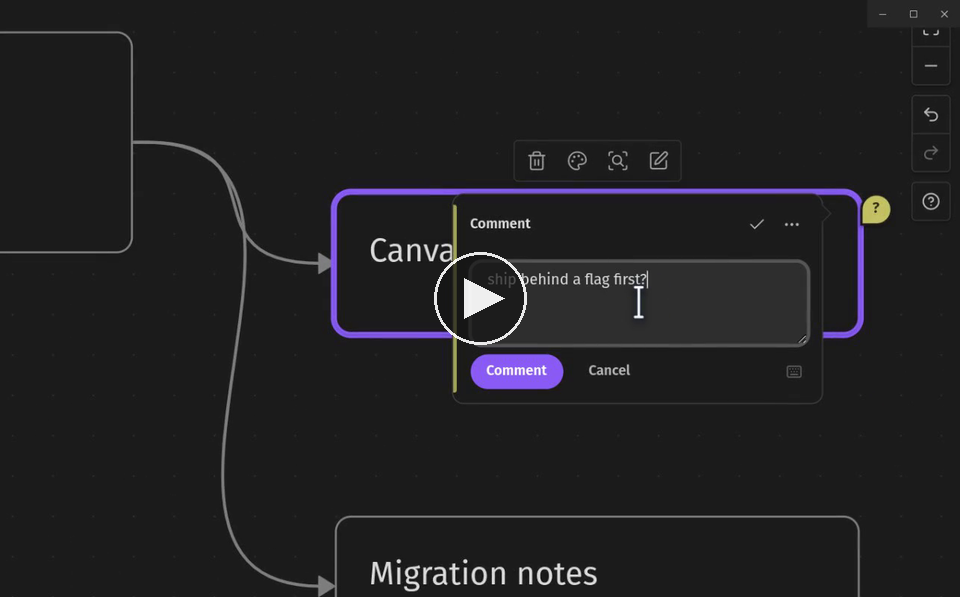
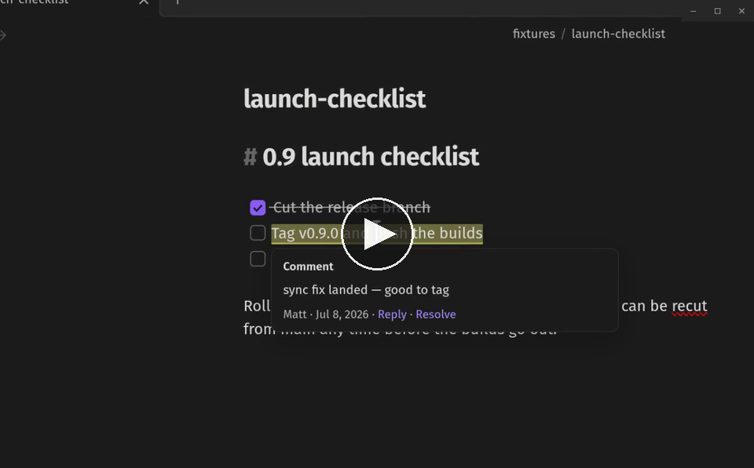

# Relay Comments

Comments and suggested edits for Obsidian notes — stored in the note itself.

Select text, add a comment, and discuss it in a review sidebar, Google
Docs-style. Propose additions, deletions, and replacements that the author
can accept or reject with one action. Everything is written into the
Markdown file as plain [CriticMarkup](#the-format), so review state
survives without a server, syncs with anything that syncs text, and stays
readable in any editor.

## Discuss a passage

Select text and comment — `Ctrl+Alt+M` (`Cmd+Opt+M` on macOS), the margin
button, or the right-click menu. Replies stack into a thread anchored to
the passage, and collaborators' comments land in your note as they write
them. Hover any commented passage to read the thread in place; the
preview's links reply or open the full thread.


## Suggest edits

Mark additions `{++like this++}`, deletions `{--like this--}`, and
replacements `{~~old~>new~~}`. Review them where they sit: hover a
suggestion and **Accept** or **Reject** it from the preview — or sweep
the whole note at once with `Finalize for publish`.

[](docs/suggested-edits.mp4)

## Review in the sidebar

Every comment, suggestion, and highlight in the note, in document order,
with colored spines and diff chips so you can scan what each one is.
Click a card to jump to its place in the note; resolve a thread with one
click — the markup leaves the note, the text stays.

[](docs/review-sidebar.mp4)

## Comment on canvases

Figma-style pins on any canvas: comment on a card — from its right-click
menu or by clicking it in comment mode — and the pin docks at the card's
corner; click the empty board to drop a freestanding pin right there.
Pins carry the author's initial, hold their size at any zoom, ride their
card when it moves, and open a floating thread to read, reply, and
resolve.

[](docs/canvas-comments.mp4)

## Review checklists

Marked-up tasks stay real tasks. Highlight, comment on, or suggest a
checklist item and its checkbox keeps rendering — and keeps working —
inside the mark in the editor, so you can tick things off mid-review.
Sidebar cards quote the task text without the `- [ ]` noise.

[](docs/task-checklist.mp4)

## Works standalone, better with Relay

No account or plugin dependency required. When the
[Relay](https://relay.md) plugin is present, comments in shared folders
resolve to real collaborator names and avatars, and threads update live
as teammates type.

## Usage notes

- Live Preview and Reading mode render review marks and hide the raw
  delimiters; Source mode shows the plain text. Half-typed markup is
  never hidden, so nothing silently disappears while you type.
- Sidebar cards carry **Resolve**; suggestions add **Accept** /
  **Reject** under the `⋯` menu.
- On a canvas, the add-comment shortcut starts click-to-place.

Commands (search "Relay Comments" in the command palette): open/close the
review sidebar, add comment, add comment to canvas (click to place), show
comment preview at cursor, highlight selection, mark selection as
addition/deletion/substitution, accept/reject current, accept/reject all,
and finalize for publish. The ribbon icon toggles the sidebar.

## The format

Notes stay portable because review state is plain text in the
[CriticMarkup](https://github.com/CriticMarkup/CriticMarkup-toolkit) syntax:

| Mark | Syntax |
| --- | --- |
| Addition | `{++inserted text++}` |
| Deletion | `{--removed text--}` |
| Replacement | `{~~old~>new~~}` |
| Highlight | `{==marked text==}` |
| Comment | `{>>comment text<<}` |

Comments written by the plugin carry attribution metadata in a
backwards-compatible extension of the comment mark:

```
{==the passage==}{{author="Maya Chen" date="2026-06-30T14:22:00Z">>Can we ground this sooner?<<}}
```

Any CriticMarkup-aware tool still reads the note; plain-Markdown tools see
readable text with visible annotations.

## Installation

Relay Comments is not yet in the community plugin catalog. To install
manually:

1. Build or download `main.js`, `manifest.json`, and `styles.css`.
2. Copy them to `<vault>/.obsidian/plugins/relay-comments/`.
3. Enable **Relay Comments** in Settings → Community plugins.

## Development

```bash
npm install
npm run check   # typecheck src/
npm run build   # typecheck + produce main.js
```

Unit tests live in `tests/unit/` — `npm test` runs them on any checkout.
See [CONTRIBUTING](CONTRIBUTING.md).

## License

[MIT](LICENSE)
