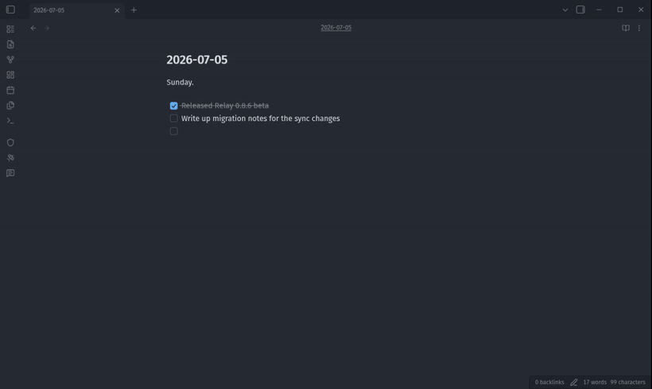
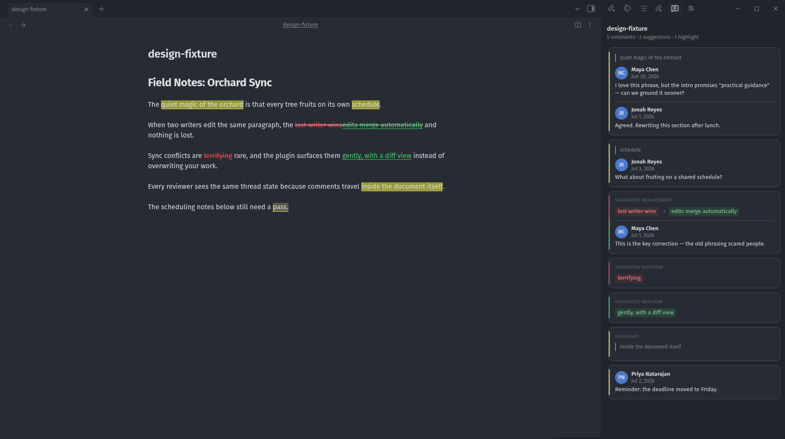

# Relay Comments

Comments and suggested edits for Obsidian notes — stored in the note itself.

Select text, add a comment, and discuss it in a review sidebar, Google
Docs-style. Propose additions, deletions, and replacements that the author
can accept or reject with one action. Everything is written into the
Markdown file as plain [CriticMarkup](#the-format), so review state
survives without a server, syncs with anything that syncs text, and stays
readable in any editor.



## Features

- **Comment threads** — select text and comment; replies stack into a
  thread anchored to the passage. Resolving a thread removes the markup and
  keeps the text.
- **Suggested edits** — mark additions `{++like this++}`, deletions
  `{--like this--}`, and replacements `{~~old~>new~~}`. Accept or reject
  each one from the sidebar, at the cursor, or all at once
  (`Finalize for publish`).
- **Review sidebar** — every comment, suggestion, and highlight in the
  active note, in document order. Cards carry a colored spine and diff
  chips so you can scan what kind of change each one is.
- **Read without opening** — hover a commented passage to preview the
  thread in place: the quote, the comment, and the reply count. A command
  shows the same preview at the cursor for keyboard users.
- **Clean reading** — Live Preview and Reading mode render review marks and
  hide the raw delimiters; Source mode shows the plain text. Half-typed
  markup is never hidden, so nothing silently disappears while you type.
- **Works standalone, better with [Relay](https://relay.md)** — no account
  or plugin dependency required. When the Relay plugin is present, comments
  in shared folders resolve to real collaborator names and avatars, and
  threads update live as teammates type.



## Usage

- Select text and click the comment button that appears in the margin, use
  the right-click menu, or press `Ctrl+Alt+M` (`Cmd+Opt+M` on macOS).
- Hover a highlighted passage to read its thread without leaving the note;
  click it to open the thread in the sidebar. Click a sidebar card to jump
  to its place in the note.
- Hover a card for **Resolve**; suggestions add **Accept** / **Reject**
  under the `⋯` menu.

Commands (search "Relay Comments" in the command palette): open/close the
review sidebar, add comment, show comment preview at cursor, highlight
selection, mark selection as addition/deletion/substitution, accept/reject
current, accept/reject all, and finalize for publish. The ribbon icon
toggles the sidebar.

## The format

Notes stay portable because review state is plain text in the
[CriticMarkup](https://github.com/CriticMarkup/CriticMarkup-toolkit) syntax:

| Mark | Syntax |
| --- | --- |
| Addition | `{++inserted text++}` |
| Deletion | `{--removed text--}` |
| Replacement | `{~~old~>new~~}` |
| Highlight | `{==marked text==}` |
| Comment | `{>>comment text<<}` |

Comments written by the plugin carry attribution metadata in a
backwards-compatible extension of the comment mark:

```
{==the passage==}{{author="Maya Chen" date="2026-06-30T14:22:00Z">>Can we ground this sooner?<<}}
```

Any CriticMarkup-aware tool still reads the note; plain-Markdown tools see
readable text with visible annotations.

## Installation

Relay Comments is not yet in the community plugin catalog. To install
manually:

1. Build or download `main.js`, `manifest.json`, and `styles.css`.
2. Copy them to `<vault>/.obsidian/plugins/relay-comments/`.
3. Enable **Relay Comments** in Settings → Community plugins.

## Development

```bash
npm install
npm run check   # typecheck src/
npm run build   # typecheck + produce main.js
```

Unit tests under `tests/unit/` are encrypted with git-crypt and require the
repo key (`npm test` after `git-crypt unlock`). Checkouts without the key
still typecheck and build; maintainers run the test suites for pull
requests. See [CONTRIBUTING](CONTRIBUTING.md).

## License

[MIT](LICENSE)
